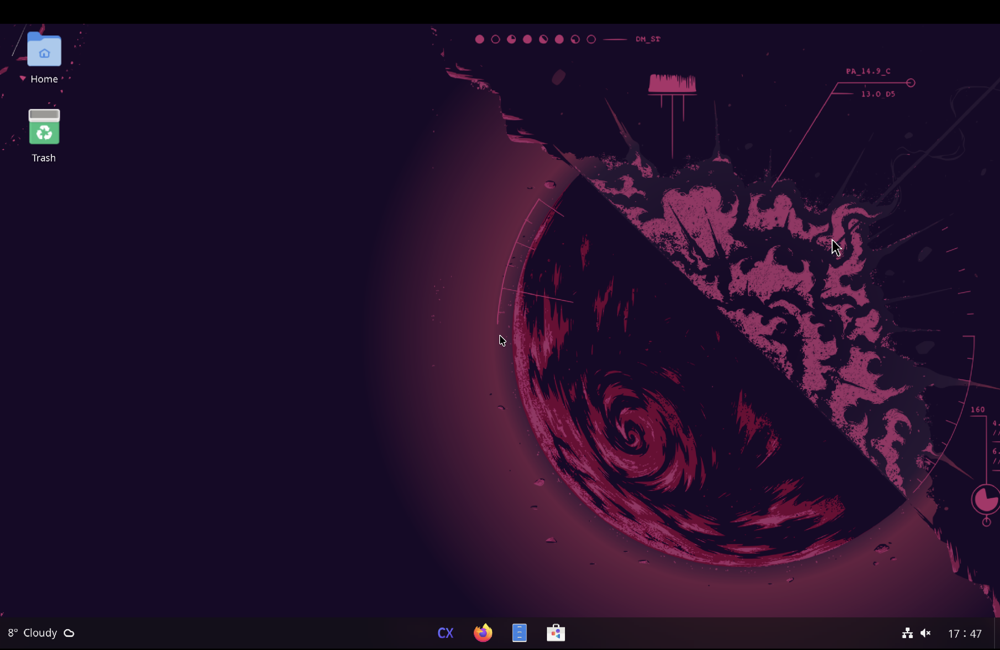

# Cortex Linux

[](LICENSE)
[](https://github.com/cortexlinux/cortex-distro/discussions)
[](https://www.cortexlinux.com/)


Cortex Linux is a custom Ubuntu-based Linux distribution that offers a familiar and easy-to-use experience for anyone moving to Linux.

[Download Cortex Linux](https://www.cortexlinux.com/)



## How to build

It is suggested to use Cortex Linux to build Cortex Linux.

To build the OS, run the following command:

```bash
make
```

To edit the build parameters, modify the `./src/args.sh` file.

That's it. The built file will be an ISO file in the `./src/dist` directory.

Simply mount the built ISO file to an virtual machine, and you can start testing it.

## Document

[Read the document](https://docs.cortexlinux.com/)

## License

This project is licensed under the Business Source License 1.1 - see the [LICENSE](LICENSE) file for details

The open-source software included in Cortex Linux is distributed in the hope that it will be useful, but WITHOUT ANY WARRANTY.

[List of open-source software included in Cortex Linux](OSS.md)

## Support

For community support and discussion, please join our [Cortex Linux Discussions](https://github.com/cortexlinux/cortex-distro/discussions).

For bug reports and feature requests, please use the [Issues](https://github.com/cortexlinux/cortex-distro/issues) page.

<!-- Planned future work:

* ARM support.
* WSL support.
* Docker container support.
* Layer based OS. Including: WSL\Server\Pro\Lite\Home\Workstation
* LiberOS.
* Customized installer instead of ubiquity.
* Customized apt source with our own override.
* Customized kernel with our own override. -->